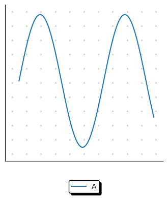

# Pimp My Plot

<p align="center">
  
</p>


This is a small collection of functions to make better looking matplotlib plots.

The package has minimal dependencies and fully compatible with standard `matplotlib` library.


## Getting started

Install the package via pip

```
pip instsall pimpmyplot
```


Use the package simply calling its functions after you created a matplotlib plot


```
import pimpmyplot as pmp
import matplotlib.pyplot as plt
import numpy as np

x = np.linspace(0, 10, 100)
plt.figure(figsize=(4, 4))
plt.plot(x, np.sin(x), label='A')

pmp.legend()                        # same as plt legend but better looking and horizontal labels as default
pmp.bullet_grid(stepinch=.3)        # dotted grid similar to a bllet journal
pmp.remove_axis('top', 'right')     # remove axis in a simpler way
pmp.remove_ticks()                  # remove ticks in a simpler way
```

<br>
<p align="center">
  
</p>


## Demo

For a small interactive demo visit [this marimo notebook](https://molab.marimo.io/notebooks/nb_Mxpo94jXpEhTj32ayiEoJn) on molab.
